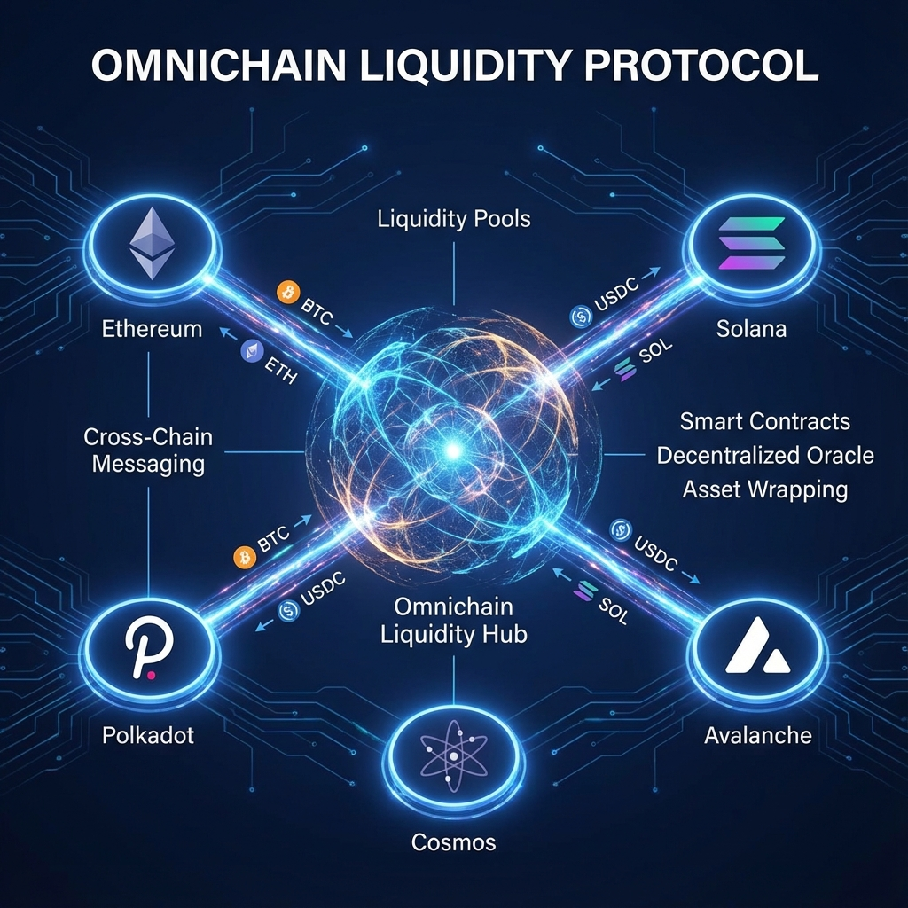

# Fusion Prime Core

**Fusion Prime** is an institutional-grade omnichain liquidity and settlement protocol. It provides a unified layer for digital asset treasury management, secure programmable escrows, and real-time risk analytics across multiple EVM-compatible networks.

> [!NOTE]
> **Project Status**: Development has progressed considerably and is in an active state. Core backend services and smart contract architectures are operational. Current focus is on comprehensive testing and validation of core features across local, cloud, and testnet environments.

---

## 🏗️ Technical Implementation

Fusion Prime is engineered with a high-performance, modular architecture designed for institutional reliability and scalability.

### 🐍 Microservices Architecture (Python)
The backend is composed of several high-concurrency microservices built with **Python (FastAPI)**. This approach ensures separation of concerns and independent scalability of core platform functions:
*   **Settlement Service**: Orchestrates complex, multi-party financial flows.
*   **Risk Engine**: Delivers sub-second risk calculations and portfolio health assessments.
*   **Compliance Service**: Handles institutional-grade identity verification and AML monitoring.
*   **Event Indexer/Relayer**: High-throughput sync between on-chain state and off-chain intelligence.

### 📦 Unified SDKs (TypeScript & Python)
To accelerate institutional adoption and developer integration, we provide comprehensive, type-safe SDKs:
*   **TypeScript/React SDK**: Seamlessly integrate Fusion Prime features into modern web applications using wagmi-powered hooks and specialized React contexts.
*   **Python SDK**: Designed for algorithmic traders, treasury managers, and automated settlement workflows.

### ⚛️ Professional Frontend (React)
A high-fidelity dashboard built with **React**, **TypeScript**, and **Tailwind CSS**. It leverages **framer-motion** for institutional-grade micro-animations and **Recharts** for real-time risk visualization.

### ☁️ Infrastructure (Google Cloud Platform)
Deployed on a robust cloud foundation for maximum uptime and security:
*   **Google Cloud Run** for serverless service orchestration and automatic scaling.
*   **Cloud SQL (PostgreSQL)** for transactional data integrity.
*   **Pub/Sub** for reliable asynchronous communication between microservices.
*   **BigQuery** (In-Development): We are integrating BigQuery to enable sophisticated historical data analytics and automated institutional compliance reporting.

---

## 🚀 Key Functional Modules

### 1. Omnichain Liquidity Protocol
A sophisticated liquidity management layer that aggregates assets across Ethereum, Polygon, and other Layer 2 networks. It enables seamless cross-chain asset movement and unified collateral management.

### 2. Institutional Escrow & Settlement
Secure, multi-party programmable escrow system designed for institutional OTC trades and complex settlements. Funds are released based on verifiable on-chain triggers or institutional identity registry approvals.

### 3. Real-Time Risk & Health Engine
Continuous tracking of collateralization ratios and margin requirements using institutional-grade VaR models.

---

## 🛡️ Rigorous Testing & Security

We maintain a "Security-First" engineering culture with a comprehensive testing suite (86+ tests and counting):
*   **Foundry Suite**: Gas-optimized unit and invariant testing for smart contracts.
*   **Python Pytest**: Extensive unit and integration tests for all microservices.
*   **End-to-End (E2E) Simulation**: Automated testing of complex cross-chain settlement flows on local Anvil instances and remote testnets.
*   **Static Analysis**: Integrated Slither and Mythril checks for contract security.

---

## 🌐 Web3 & The Future of Settlement

Fusion Prime leverages advanced Web3 primitives to solve real-world institutional friction:
*   **Cross-Chain Interoperability**: Built-in support for Axelar and CCIP, abstracting away the complexity of cross-chain messaging.
*   **Self-Sovereign Identity (SSI)**: Utilizing ERC734/735 standards to allow institutions to manage their own KYC/AML credentials without relying on centralized intermediaries.
*   **Programmable Finance**: Replacing trust-based legal contracts with immutable, verifiable code.

## 📄 License

This project is licensed under the MIT License - see the [LICENSE](LICENSE) file for details.
