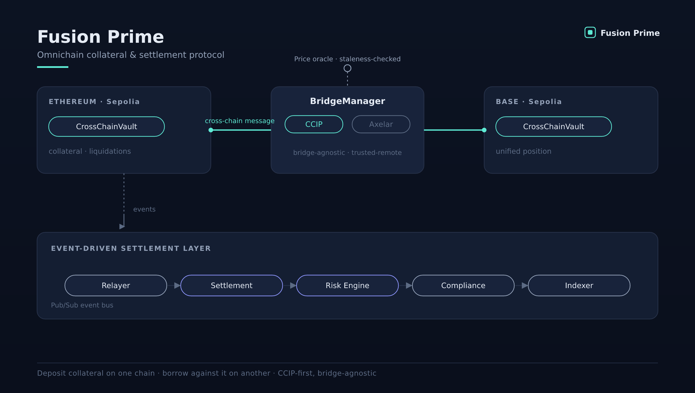
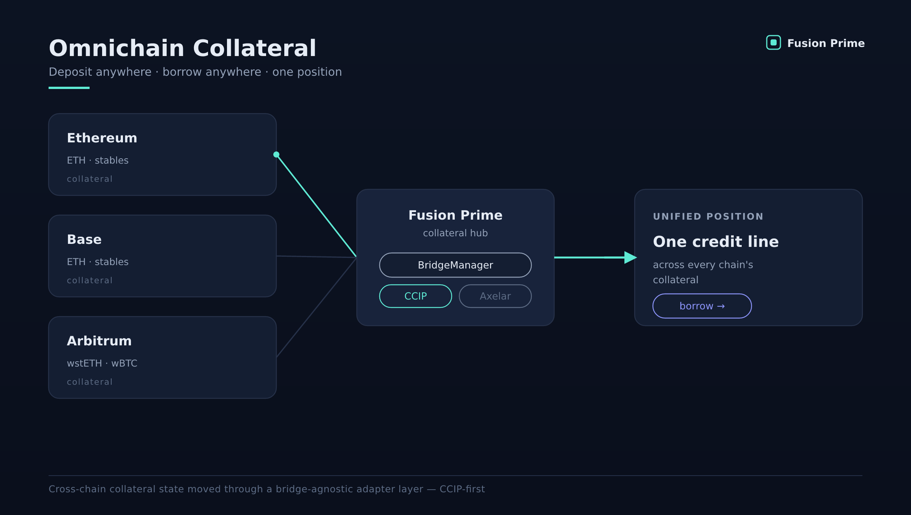
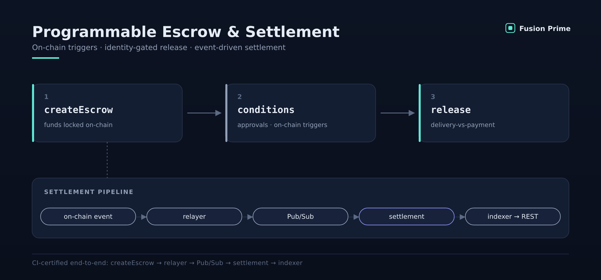

# Fusion Prime Core

**Fusion Prime** is an omnichain collateral and settlement protocol for digital-asset
treasuries. It unifies cross-chain collateral, oracle-priced risk, and programmable
settlement into one layer — so an institution can **deposit collateral on one chain and
borrow against it on another**, with settlement and compliance handled end to end.

> [!NOTE]
> **Project status.** Active development. The cross-chain vault, bridge-adapter layer, and
> the event-driven backend services are implemented and tested locally and on testnets.
> There is no production deployment, and no external security audit has been performed —
> this is engineering-in-progress, not a live venue. See
> [Architecture](docs/ARCHITECTURE.md) and [Testing](docs/TESTING.md) for technical detail.

---

## Why now — collateral mobility is the institutional thread

The 2025–2026 institutional on-chain wave has a common shape: **moving collateral and
settlement on-chain**. Stablecoin settlement volume overtook ACH; tokenized treasuries
crossed tens of billions; and cross-chain messaging became bank infrastructure —
Chainlink **CCIP** now underpins interbank tokenized-settlement pilots. Fusion Prime is
built around exactly that thread: a vault whose collateral and risk move across chains
through a **bridge-agnostic** adapter layer.

---

## 🏗️ Technical Implementation

A modular architecture designed for reliability and independent scaling.

### ⛓️ Cross-Chain Vault (Solidity / Foundry)
The core is a `CrossChainVault`: collateralized positions, an interest-rate model,
oracle-fed pricing with staleness handling, and health-factor liquidations. Cross-chain
messaging runs through a **`BridgeManager` + pluggable adapters** design — **Chainlink
CCIP first** (the institutional interoperability lane), with Axelar as an alternate
adapter. The abstraction is the point: the protocol is not wed to any single bridge
vendor. *On the hardening roadmap:* per-source trusted-remote allowlists and replay
protection on the inbound message path.

### 🐍 Microservices Architecture (Python / FastAPI)
Independently scalable backend services around the vault:
*   **Settlement Service** — orchestrates multi-party settlement flows.
*   **Risk Engine** — collateralization and portfolio-health assessment.
*   **Compliance Service** — identity verification and AML monitoring.
*   **Event Indexer / Relayer** — sync between on-chain state and off-chain services.

### 📦 Unified SDKs (TypeScript & Python)
Type-safe SDKs for integration:
*   **TypeScript / React SDK** — wagmi-powered hooks and React contexts for web apps.
*   **Python SDK** — for treasury automation and settlement workflows.

### ⚛️ Frontend (React)
A dashboard built with **React**, **TypeScript**, and **Tailwind CSS**, with
**Recharts** for risk visualization.

### ☁️ Cloud-Native Architecture (GCP-targeted)
The services are designed for a serverless cloud foundation — **Cloud Run** for
orchestration, **Cloud SQL (PostgreSQL)** for transactional data, **Pub/Sub** for
asynchronous messaging. Environments are provisioned ephemerally (apply → validate →
destroy) rather than run continuously; there is no standing production deployment.

---

## 🚀 Key Functional Modules

### 1. Omnichain Collateral Protocol
A collateral layer that aggregates assets across **Ethereum and its L2s (Base first)**
and moves collateral state cross-chain, presenting a unified borrowing position.

### 2. Programmable Escrow & Settlement
Multi-party programmable escrow for OTC-style settlement. Funds release on verifiable
on-chain triggers or identity-registry approvals.

### 3. Real-Time Risk & Health Engine
Continuous tracking of collateralization ratios and margin requirements, driven by
oracle prices with explicit staleness handling.

---

## 🛡️ Testing & Security

A security-first engineering culture:
*   **Foundry suite** — unit, **fuzz**, and **invariant** testing for the contracts;
    invariants protect vault accounting.
*   **Symbolic execution** — Halmos proofs over critical contract invariants.
*   **Multiple static analyzers** — Slither and Aderyn in CI on every contract change,
    plus mutation testing to check the suite's own strength.
*   **Python pytest** — unit and integration tests across the microservices.
*   **End-to-end simulation** — cross-chain and settlement flows on local Anvil and
    testnets.

> No external audit has been performed. This code is not intended for use with real
> funds in its current state.

---

## 🌐 Web3 & The Future of Settlement

*   **Cross-Chain Interoperability** — a bridge-agnostic adapter layer (CCIP-first,
    Axelar-capable) that abstracts cross-chain messaging away from the application.
*   **Real-World Asset collateral** — designed to extend to tokenized treasuries and
    other RWA collateral, the fastest-growing institutional on-chain segment.
*   **Self-Sovereign Identity** — ERC-734/735 so institutions manage their own KYC/AML
    credentials without a centralized intermediary.
*   **Programmable Finance** — settlement logic as verifiable code rather than
    trust-based process.

## 📄 License

Intended to be released under the MIT License. *(A `LICENSE` file has not yet been added
to this repository.)*
