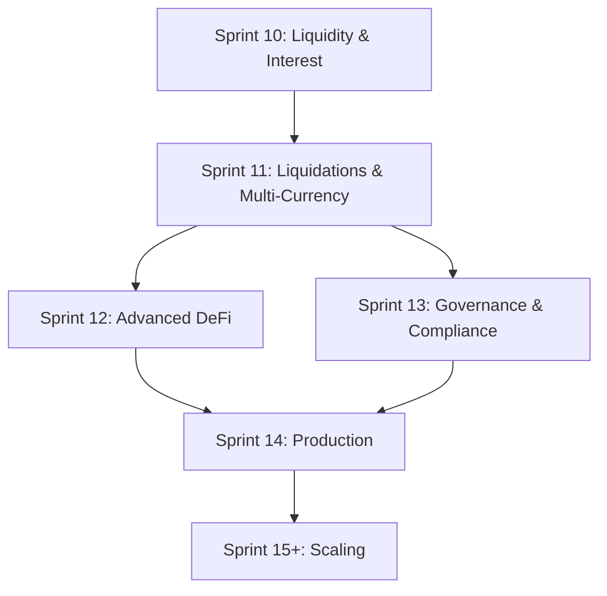

# Fusion Prime - Sprint Roadmap (Sprints 11-13+)

**Purpose**: Strategic roadmap for upcoming sprints to reach production readiness

**Status**: 📋 **DRAFT** (Subject to revision)

**Last Updated**: 2025-11-20

---

## Overview

This roadmap outlines the path from current state (Sprint 10 complete) to a production-ready, compliant, multi-chain lending protocol competitive with Aave and Compound.

**Current State** (Post-Sprint 10):
- ✅ Cross-chain lending with unified liquidity
- ✅ Utilization-based interest rates
- ✅ Chainlink oracle integration
- ✅ V23 vaults operational on Sepolia + Amoy

**Target State** (Post-Sprint 13):
- ✅ Liquidation mechanism
- ✅ Multi-currency support (ERC20 tokens)
- ✅ Governance system
- ✅ KYC/compliance enforcement
- ✅ Production-ready for mainnet

---

## Sprint 11: Liquidations & Multi-Currency

**Duration**: 2-3 weeks  
**Status**: 📋 **PLANNED**  
**Priority**: **CRITICAL** (Required for production)

### Objectives

1. **Liquidation Mechanism** (30 hours)
   - Implement `liquidate()` function in V29
   - Add liquidation bonus (5-10%)
   - Create liquidation bot
   - Add frontend liquidation UI

2. **Multi-Currency Support** (25 hours)
   - Support ERC20 tokens: USDC, DAI, WETH, WBTC
   - Implement `depositCollateralERC20()`, `withdrawCollateralERC20()`
   - Implement `borrowERC20()`, `repayERC20()`
   - Integrate Chainlink price feeds for all tokens
   - Update frontend for token selection

3. **Testing & Deployment** (10 hours)
   - Comprehensive testing
   - Deploy V29 to Sepolia and Amoy
   - Deploy liquidation bot

### Success Criteria
- ✅ Liquidation works at health factor < 100%
- ✅ Liquidation bot monitors and executes
- ✅ 4+ ERC20 tokens supported
- ✅ Cross-chain token sync works
- ✅ All tests pass

### Deliverables
- `CrossChainVaultV29.sol` with liquidation + ERC20
- Liquidation bot service
- Updated frontend with token selection
- Comprehensive test suite

**Detailed Plan**: [sprint-11-implementation-plan.md](./sprint-11-implementation-plan.md)

---

## Sprint 12: Advanced DeFi Features

**Duration**: 2-3 weeks  
**Status**: 📋 **DRAFT**  
**Priority**: **HIGH** (Competitive parity)

### Objectives

1. **Variable vs Stable Interest Rates** (15 hours)
   - Implement dual-rate system like Aave
   - Users choose stable (predictable) or variable (market-driven) rates
   - Add rate switching mechanism
   - Update interest calculation logic

2. **Collateral Factor Per Asset** (10 hours)
   - Different collateral factors for different assets
   - Example: USDC = 90%, WETH = 85%, WBTC = 75%
   - Risk-based collateral requirements
   - Update health factor calculations

3. **Reserve Factor & Protocol Revenue** (10 hours)
   - Protocol takes 10% of interest as reserve
   - Accumulate reserves for insurance fund
   - Add `withdrawReserves()` for governance
   - Track protocol revenue

4. **Emergency Pause Mechanism** (8 hours)
   - Circuit breaker for critical bugs
   - Pause deposits/borrows/liquidations
   - Admin-only unpause
   - Event logging

5. **Flash Loans** (Optional, 15 hours)
   - Implement flash loan functionality
   - Borrow without collateral (must repay in same tx)
   - Flash loan fee (0.09% like Aave)
   - Use cases: arbitrage, liquidations, collateral swaps

### Success Criteria
- ✅ Users can choose stable or variable rates
- ✅ Collateral factors enforced per asset
- ✅ Protocol revenue accumulates
- ✅ Emergency pause works
- ✅ Flash loans functional (if implemented)

### Deliverables
- `CrossChainVaultV30.sol` with advanced features
- Updated interest rate model
- Reserve tracking system
- Emergency pause admin interface

**Estimated Time**: 43-58 hours

---

## Sprint 13: Governance & Compliance

**Duration**: 3-4 weeks  
**Status**: 📋 **DRAFT**  
**Priority**: **HIGH** (Required for institutional adoption)

### Part A: Governance System (25 hours)

1. **Governance Token (FP Token)** (10 hours)
   - Deploy ERC20 governance token
   - Initial distribution strategy
   - Vesting schedules for team/investors
   - Liquidity mining rewards

2. **Voting Mechanism** (10 hours)
   - Propose parameter changes (interest rates, collateral factors, etc.)
   - Token-weighted voting
   - Timelock for execution (2-day delay)
   - Quorum requirements

3. **Protocol Fee Distribution** (5 hours)
   - Distribute protocol revenue to FP token holders
   - Staking mechanism for rewards
   - Claim rewards interface

### Part B: KYC/Compliance Enforcement (30 hours)

1. **Identity Contract Integration** (10 hours)
   - Import `IERC735` interface
   - Import `Identity` contract interface
   - Add identity registry mapping
   - Link user addresses to identity contracts

2. **Vault Gating** (8 hours)
   - Add `onlyCompliant` modifier
   - Check for `KYC_VERIFIED` claim (Topic 1)
   - Apply to: `supply()`, `borrow()`, `depositCollateral()`
   - Graceful error messages

3. **Compliance Service Integration** (12 hours)
   - Connect to existing compliance service
   - KYC verification flow
   - Claim issuance after KYC approval
   - Frontend KYC status display

4. **Admin Controls** (Optional, 5 hours)
   - Whitelist mode (KYC required)
   - Permissionless mode (no KYC)
   - Toggle per deployment
   - Regulatory flexibility

### Success Criteria
- ✅ FP governance token deployed
- ✅ Voting system functional
- ✅ Protocol fees distributed to stakers
- ✅ KYC verification integrated
- ✅ Vault gating enforces compliance
- ✅ Frontend shows KYC status

### Deliverables
- `FusionPrimeToken.sol` (ERC20 governance token)
- `Governance.sol` (voting + proposals)
- `CrossChainVaultV31.sol` with compliance gating
- Updated frontend with KYC flow
- Integration with compliance service

**Estimated Time**: 55 hours

---

## Production Readiness (Parallel to Sprints 11-13)

**Duration**: Ongoing throughout development  
**Status**: 📋 **CRITICAL**  
**Priority**: **HIGHEST** (Required before mainnet)

> [!CAUTION]
> Production readiness activities MUST be completed before mainnet deployment. These are not optional and should run in parallel with feature development.

### 1. Monitoring & Observability (15 hours)

**Purpose**: Real-time visibility into system health and user activity

#### Infrastructure Monitoring
- **Metrics Collection** (5 hours)
  - Prometheus for metrics
  - Grafana for dashboards
  - Track: RPC latency, gas prices, transaction success rate
  - Alert on: RPC failures, high gas prices, failed transactions

- **Log Aggregation** (3 hours)
  - Centralized logging (ELK stack or Datadog)
  - Structured logs from all services
  - Log levels: ERROR, WARN, INFO, DEBUG
  - Retention: 30 days

- **Dashboards** (4 hours)
  - System health dashboard
  - User activity dashboard
  - Financial metrics (TVL, borrow volume, interest earned)
  - Liquidation monitoring

- **Alerting** (3 hours)
  - PagerDuty or similar for critical alerts
  - Slack notifications for warnings
  - Alert on: contract paused, liquidation bot down, oracle failure

#### Smart Contract Monitoring
- **Event Indexing** (The Graph or custom indexer)
  - Index all vault events
  - Track user positions in real-time
  - Historical data for analytics

- **On-Chain Metrics**
  - Total Value Locked (TVL)
  - Utilization rate per chain
  - Number of active users
  - Liquidation events
  - Protocol revenue

**Tools**:
- Prometheus + Grafana
- The Graph for event indexing
- Tenderly for transaction monitoring
- Alchemy/Infura webhooks for real-time events

---

### 2. Load Testing & Performance (12 hours)

**Purpose**: Ensure system can handle production load

#### Smart Contract Load Testing (5 hours)
- **Foundry Fuzzing**
  - Fuzz all public functions
  - Test with random inputs
  - Identify edge cases

- **Gas Profiling**
  - Profile gas usage for all operations
  - Optimize high-gas functions
  - Target: < 200k gas per operation

- **Stress Testing**
  - Simulate 1000+ concurrent users
  - Test with maximum position sizes
  - Test liquidation cascades

#### Backend Load Testing (4 hours)
- **Liquidation Bot**
  - Test with 100+ liquidatable positions
  - Measure execution time
  - Test under high gas prices

- **RPC Load**
  - Test RPC rate limits
  - Implement request batching
  - Add fallback RPC providers

#### Frontend Load Testing (3 hours)
- **Lighthouse Performance**
  - Target: > 90 performance score
  - Optimize bundle size
  - Lazy loading for components

- **User Flow Testing**
  - Test deposit/borrow/repay flows
  - Measure time to first interaction
  - Test with slow network conditions

**Tools**:
- Foundry fuzzing
- k6 or Locust for load testing
- Lighthouse for frontend performance

---

### 3. Security Measures (25 hours)

**Purpose**: Protect user funds and prevent exploits

#### Smart Contract Security (15 hours)

**Static Analysis** (3 hours)
- Slither for vulnerability detection
- Mythril for symbolic execution
- Aderyn for common patterns
- Fix all HIGH and MEDIUM findings

**Manual Review** (5 hours)
- Reentrancy checks
- Integer overflow/underflow
- Access control verification
- Oracle manipulation resistance
- Flash loan attack vectors

**Formal Verification** (Optional, 7 hours)
- Certora or similar
- Verify critical invariants:
  - Total collateral >= total borrowed
  - Health factor calculations correct
  - No unauthorized withdrawals

#### Operational Security (5 hours)

**Key Management**
- Hardware wallets for admin keys
- Multi-sig for critical operations
- Timelock for governance actions
- Key rotation procedures

**Access Control**
- Role-based access control (RBAC)
- Principle of least privilege
- Audit logs for admin actions

**Incident Response Plan**
- Emergency pause procedures
- Communication plan
- Fund recovery procedures
- Post-mortem template

#### Bug Bounty Program (5 hours)
- Immunefi or HackerOne
- Rewards: $1k-$100k based on severity
- Scope: All smart contracts
- Launch before mainnet

**Security Checklist**:
```
[ ] Slither analysis clean
[ ] Mythril analysis clean
[ ] Manual security review complete
[ ] Multi-sig setup for admin
[ ] Emergency pause tested
[ ] Bug bounty program live
[ ] Incident response plan documented
```

---

### 4. Security Audit (External)

**Duration**: 4-6 weeks  
**Cost**: $50k-$150k  
**Priority**: **CRITICAL** (Required before mainnet)

#### Audit Firms (Choose 1-2)
1. **Trail of Bits** - Top tier, $100k+
2. **OpenZeppelin** - Reputable, $75k+
3. **Consensys Diligence** - Established, $80k+
4. **Cyfrin** - Competitive, $50k+

#### Audit Scope
- All vault contracts (V29-V31)
- Governance contracts
- Identity/compliance integration
- Price oracle integration
- Message bridge

#### Audit Process
1. **Pre-Audit** (Week 1)
   - Freeze code
   - Provide documentation
   - Explain architecture

2. **Audit** (Weeks 2-4)
   - Auditors review code
   - Weekly check-ins
   - Preliminary findings

3. **Remediation** (Week 5)
   - Fix all findings
   - Re-submit for review

4. **Final Report** (Week 6)
   - Public audit report
   - All issues resolved
   - Sign-off for mainnet

**Timeline**: Schedule audit after Sprint 12 completion

---

### 5. Testing Strategy (Comprehensive)

**Test Coverage Target**: > 90%

#### Unit Tests (Foundry)
```bash
forge test -vvv
forge coverage
```

**Coverage Requirements**:
- Core functions: 100%
- Edge cases: 90%
- Error handling: 95%

#### Integration Tests
- Cross-chain message flow
- Multi-token positions
- Liquidation scenarios
- Interest accrual over time

#### End-to-End Tests
- Full user journeys
- Deposit → Borrow → Repay → Withdraw
- Cross-chain collateral usage
- Liquidation execution

#### Testnet Testing Checklist
```
[ ] Deploy to Sepolia
[ ] Deploy to Amoy
[ ] Configure trusted vaults
[ ] Test deposits on both chains
[ ] Test cross-chain borrowing
[ ] Test liquidations
[ ] Test all ERC20 tokens
[ ] Test governance voting
[ ] Test KYC flow
[ ] Run for 1 week with real users
```

#### Mainnet Fork Testing
```bash
# Test on mainnet fork with real data
forge test --fork-url https://eth-mainnet.g.alchemy.com/v2/YOUR_KEY
```

---

### 6. Deployment Procedures

#### Pre-Deployment Checklist
```
[ ] All tests passing (100%)
[ ] Security audit complete
[ ] Bug bounty live for 2+ weeks
[ ] Monitoring infrastructure ready
[ ] Incident response plan documented
[ ] Multi-sig wallets configured
[ ] RPC providers configured (primary + backup)
[ ] Frontend deployed to production
[ ] Documentation complete
[ ] Legal review complete (if applicable)
```

#### Deployment Steps

**Phase 1: Testnet Validation** (1 week)
1. Deploy to Sepolia + Amoy
2. Run for 1 week with beta testers
3. Monitor for issues
4. Fix any bugs found

**Phase 2: Mainnet Soft Launch** (2 weeks)
1. Deploy to Ethereum + Polygon mainnet
2. Set low deposit caps ($100k total)
3. Invite whitelisted users only
4. Monitor 24/7
5. Gradually increase caps

**Phase 3: Public Launch** (Ongoing)
1. Remove deposit caps
2. Public announcement
3. Marketing campaign
4. Continuous monitoring

#### Deployment Script
```bash
# Deploy to mainnet
forge script script/DeployMainnet.s.sol \
  --rpc-url $MAINNET_RPC \
  --broadcast \
  --verify \
  --slow # Use slow mode for verification
```

---

### 7. Continuous Monitoring (Post-Launch)

#### Daily Checks
- [ ] System health dashboard green
- [ ] No critical alerts
- [ ] TVL trending up
- [ ] No failed transactions
- [ ] Liquidation bot operational

#### Weekly Reviews
- [ ] Review all alerts
- [ ] Check gas optimization opportunities
- [ ] Review user feedback
- [ ] Update documentation
- [ ] Security scan (automated)

#### Monthly Reviews
- [ ] Financial metrics review
- [ ] Security posture review
- [ ] Performance optimization
- [ ] Roadmap adjustment
- [ ] Team retrospective

---

## Sprint 14+: Production Readiness & Scaling

**Duration**: Ongoing  
**Status**: 📋 **FUTURE**  
**Priority**: **MEDIUM-HIGH**

### Potential Features

1. **Mainnet Deployment** (20 hours)
   - Deploy to Ethereum mainnet
   - Deploy to Polygon mainnet
   - Deploy to Base, Arbitrum, Optimism
   - Mainnet relayer infrastructure
   - Security audit

2. **Multi-Chain Expansion** (16 hours per chain)
   - Base (EVM L2)
   - Arbitrum (EVM L2)
   - Optimism (EVM L2)
   - Solana (40 hours - different VM)

3. **Advanced Risk Management** (25 hours)
   - Liquidation cascades prevention
   - Circuit breakers for market crashes
   - Dynamic collateral factors based on volatility
   - Insurance fund for bad debt

4. **Performance Optimization** (15 hours)
   - Gas optimization
   - Batch operations
   - Off-chain computation with on-chain verification
   - Layer 2 scaling

5. **User Experience Polish** (20 hours)
   - Transaction history
   - Position overview dashboard
   - Mobile app
   - Notifications

6. **Institutional Features** (30 hours)
   - Whitelabel deployments
   - Custom interest rate curves
   - Private pools
   - API for institutional integration

---

## Dependency Graph



**Critical Path**: S10 → S11 → S13 → S14 (Mainnet)

---

## Timeline Estimate

| Sprint | Duration | Est. Completion | Dev Hours | Production Readiness |
|--------|----------|-----------------|-----------|---------------------|
| Sprint 10 | ✅ Complete | 2025-11-20 | - | - |
| Sprint 11 | 2-3 weeks | 2025-12-11 | 65 hours | Monitoring setup (15h) |
| Sprint 12 | 2-3 weeks | 2026-01-01 | 43-58 hours | Load testing (12h) |
| Sprint 13 | 3-4 weeks | 2026-01-29 | 55 hours | Security audit starts |
| Audit Period | 4-6 weeks | 2026-03-12 | - | External audit (6 weeks) |
| Sprint 14 | 2-3 weeks | 2026-04-02 | 20 hours | Final testing + deployment |

**Production Readiness Activities** (Parallel):
- Monitoring & Observability: 15 hours (Sprint 11)
- Load Testing: 12 hours (Sprint 12)
- Security Measures: 25 hours (Sprint 11-12)
- External Audit: 4-6 weeks (After Sprint 13)
- Deployment Prep: Ongoing

**Target Mainnet Launch**: April 2026

**Total Development Time**: 183-198 hours + 52 hours production readiness = **235-250 hours**

---

## Feature Comparison with Competitors

### Post-Sprint 11

| Feature | Aave | Compound | Fusion Prime |
|---------|------|----------|--------------|
| Liquidations | ✅ | ✅ | ✅ |
| Multi-Currency | ✅ | ✅ | ✅ |
| Cross-Chain Unified | ❌ | ❌ | ✅ |
| Interest Rates | ✅ | ✅ | ✅ |
| Flash Loans | ✅ | ❌ | ❌ |
| Governance | ✅ | ✅ | ❌ |

### Post-Sprint 12

| Feature | Aave | Compound | Fusion Prime |
|---------|------|----------|--------------|
| Variable/Stable Rates | ✅ | ❌ | ✅ |
| Flash Loans | ✅ | ❌ | ✅ |
| Reserve Factor | ✅ | ✅ | ✅ |
| Emergency Pause | ✅ | ✅ | ✅ |
| Cross-Chain | ❌ | ❌ | ✅ |

### Post-Sprint 13

| Feature | Aave | Compound | Fusion Prime |
|---------|------|----------|--------------|
| Governance | ✅ | ✅ | ✅ |
| KYC/Compliance | ❌ | ❌ | ✅ |
| Cross-Chain | ❌ | ❌ | ✅ |
| Institutional Ready | Partial | Partial | ✅ |

**Unique Advantages**:
1. Cross-chain unified liquidity (no bridging)
2. Built-in KYC/compliance (institutional-ready)
3. Flexible compliance modes (permissioned or permissionless)

---

## Risk Assessment

### Sprint 11 Risks
- **High**: Liquidation bugs could cause loss of funds
- **Medium**: ERC20 cross-chain sync complexity
- **Mitigation**: Thorough testing, security audit

### Sprint 12 Risks
- **Medium**: Flash loan attack vectors
- **Medium**: Interest rate model complexity
- **Mitigation**: Follow Aave's proven patterns, extensive testing

### Sprint 13 Risks
- **High**: Compliance integration complexity
- **Medium**: Governance attack vectors
- **Mitigation**: Use battle-tested governance contracts, legal review

### Overall Risks
- **Smart contract bugs**: Security audit before mainnet
- **Oracle failures**: Multiple oracle sources, staleness checks
- **Regulatory changes**: Flexible compliance architecture
- **Market volatility**: Circuit breakers, insurance fund

---

## Success Metrics

### Technical Metrics
- **Test Coverage**: > 90%
- **Gas Efficiency**: < 200k gas per operation
- **Uptime**: > 99.9%
- **Liquidation Speed**: < 5 minutes from undercollateralized

### Business Metrics
- **TVL**: $10M+ by Q2 2026
- **Users**: 1,000+ by Q2 2026
- **Chains**: 5+ by Q3 2026
- **Institutional Clients**: 3+ by Q4 2026

---

## Open Questions

1. **Sprint 11**: Should we implement liquidations and multi-currency together, or split into two sprints?
2. **Sprint 12**: Should flash loans be included or deferred?
3. **Sprint 13**: Should KYC be mandatory or optional (toggle)?
4. **Mainnet**: Which chains to prioritize for mainnet launch?
5. **Governance**: What should initial FP token distribution look like?

---

## Next Steps

1. **Immediate**: Finalize Sprint 11 scope (liquidations + multi-currency)
2. **Week 1**: Start Sprint 11 implementation
3. **Week 3**: Review Sprint 12 plan based on Sprint 11 learnings
4. **Month 2**: Begin Sprint 13 planning with legal/compliance review

---

## Related Documentation

- [Sprint 10 Completion Summary](/home/koita/dev/web3/fusion-prime/SPRINT_10_COMPLETION_SUMMARY.md)
- [Sprint 11 Implementation Plan](./sprint-11-implementation-plan.md)
- [Compliance & Identity Integration](/home/koita/dev/web3/fusion-prime/docs/COMPLIANCE_IDENTITY_INTEGRATION.md)
- [Cross-Chain Vault README](/home/koita/dev/web3/fusion-prime/contracts/cross-chain/README.md)

---

**Document Version**: 1.0 (Draft)  
**Status**: 📋 Draft - Subject to revision  
**Last Updated**: 2025-11-20  
**Next Review**: After Sprint 11 completion
